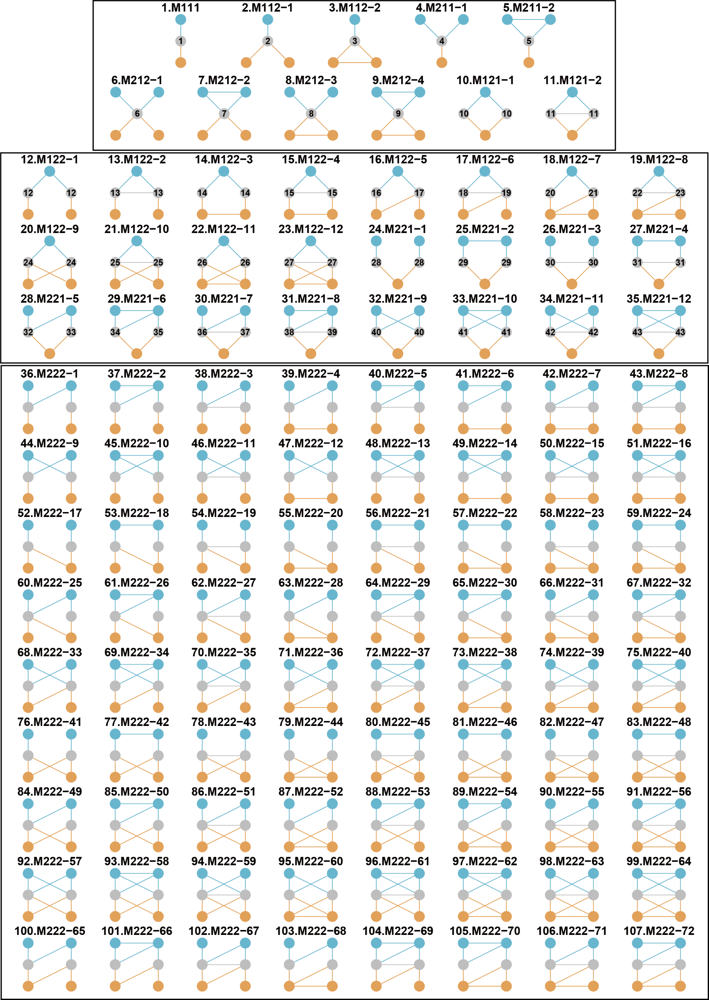

<!-- README.md is generated from README.Rmd. Please edit that file -->

```{r, include = FALSE}
knitr::opts_chunk$set(
  collapse = TRUE,
  comment = "#>"
)
```

# ILSM: A package for analyzing the interconnection structure of tripartite interaction networks (updating)

<!-- badges: start -->

<!--[](https://cran.r-project.org/package=ILSM) -->

<!-- badges: end -->

ILSM is designed to analyze interconnection structures, including interconnection patterns, centrality, and motifs in tripartite interaction networks.

## Installation

You can install the development version of *ILSM* from GitHub:

```{r echo = T, eval = F}
devtools::install_github("WeichengSun/ILSM")
```

## A common tripartite interaction network in this package
For clarification, in the following context we refer to a tripartite network as a two-subnetwork interaction network (Fig. 1a). It is composed of three sets of nodes (a-nodes, b-nodes, and c-nodes) and two subnetworks: the P subnetwork, which contains links between a-nodes and b-nodes, and the Q subnetwork, which contains links between b-nodes and c-nodes. The b-nodes serve as the shared set of nodes. Connector nodes are defined as the common nodes of both subnetworks within the b-nodes (Fig. 1a). No intra-guild interactions are considered unless specified.

```{r echo=F,eval = T,out.width = "70%",fig.align = 'center' }
knitr::include_graphics("./man/figure/trinet_and_example.png")
```
Fig.1. The visualization of an example tripartite interaction network (a, with three groups of species and two interaction subnetworks) and interconnection structures for connector species (b-c, two macro-scale interconnection patterns; d, meso-scale interconnection motif; e, micro-scale interconnection centrality). In panel a, the connector species have links from both subnetworks.

<br>We provide examples to showcase the functionality of the *ILSM* package. First, a worked example demonstrates how to calculate interconnection patterns, motifs, and centralities (Fig. 1b-c). Second, extensional functions are shown, including null models and several extra interconnection structures for tripartite networks with intra-guild interactions.

## A worked example of analyzing interconnection structures
As a worked example, we use a published pollinator–plant–herbivore (PPH) binary tripartite network (Villa-Galaviz et al. 2021). This PPH network (**PPH_Coltparkmeadow**) is a subset of a large hybrid network that includes plants, flower visitors, leaf miners, and parasitoids from a long-term nutrient manipulation experiment (Colt Park Meadows) located at 300 m elevation in Ingleborough National Nature Reserve, Yorkshire Dales, northern England (54°12′N, 2°21′W). It contains pollinators, plants, and herbivores, corresponding to mutualistic interactions in the pollinator–plant subnetwork and antagonistic interactions in the plant–herbivore subnetwork. Plants are the shared set of species between the two subnetworks. We also generate random weights to illustrate the analysis of interconnection structures in weighted or quantitative tripartite networks.

### Interconnection pattern
Interconnection pattern refers to a macro-scale property describing how connector nodes (species) interconnect two subnetworks. Five interconnection patterns are supported: proportion of connector nodes (**poc**), correlation of interaction degree (**coid**), correlation of interaction similarity (**cois**), participation coefficient (**pc**), and proportion of connector nodes in shared node hubs (**hc**).

```{r echo=T, eval = F, out.width = "100%"}
library(ILSM);library(igraph)
#Load the 'igraph' data 
data(PPH_Coltparkmeadow)
#Or read two matrices and transform them to an 'igraph'. .
P_mat<-as.matrix(read.csv("./data/PP.csv",row.names = 1,check.names=FALSE))
Q_mat<-as.matrix(read.csv("./data/HP.csv",row.names = 1,check.names=FALSE))
PPH_Coltparkmeadow<-trigraph_from_mat(P_mat,Q_mat,weighted = F)

#Generating random weights to showcase weighted metrics
E(PPH_Coltparkmeadow)$weight<-runif(length(E(PPH_Coltparkmeadow)),0.1,1.5) 

#proportion of connector nodes
poc(PPH_Coltparkmeadow)
poc(P_mat,Q_mat)
#correlation of interaction degree 
coid(PPH_Coltparkmeadow)
coid(PPH_Coltparkmeadow,weighted=T)
#correlation of interaction similarity
cois(PPH_Coltparkmeadow)
cois(PPH_Coltparkmeadow,weighted=T)
#participation coefficient 
pc(PPH_Coltparkmeadow)
pc(PPH_Coltparkmeadow,weighted=T)
#proportion of connector nodes in shared node hubs
hc(PPH_Coltparkmeadow)
hc(PPH_Coltparkmeadow,weighted=T)
```
### Interconnection motif

Here, we define 48 forms of interconnection motifs (Fig. 2). An interconnection motif must comprise three sets of connected nodes: the connector nodes (belonging to the b-nodes), the nodes in one subnetwork (belonging to the a-nodes in the P subnetwork), and the nodes in the other subnetwork (belonging to the c-nodes in the Q subnetwork). We further restrict each motif to contain no more than six nodes and to have no intra-guild interactions.

The 48 interconnection motifs are provided as *igraph* objects through the **Multi_motif** function in this package.
```{r echo=T,eval = F}
library(ILSM)
motif_names<-c("M111","M112","M113","M114","M211","M212","M213","M311","M312","M411","M121","M122-1",
       "M122-2","M122-3","M123-1","M123-2","M123-3","M123-4","M123-5","M221-1","M221-2",
       "M221-3","M222-1","M222-2","M222-3","M222-4","M222-5","M222-6","M222-7","M222-8",
       "M222-9","M321-1","M321-2","M321-3","M321-4","M321-5","M131","M132-1","M132-2",
       "M132-3","M132-4","M132-5","M231-1","M231-2","M231-3","M231-4","M231-5","M141")
mr <- par(mfrow=c(6,8),mar=c(1,1,3,1))
IM_res<-Multi_motif("all")
 for(i in 1:48){
     plot(IM_res[[i]],
          vertex.size=30, vertex.label=NA,
          vertex.color="#D0E7ED",main=motif_names[i])
}
par(mr)

```

The 48 interconnection motifs are named "MABC-i": M means "motif',"A" is the number of a-nodes, "B" is the number of b-nodes, "C" is the number of c-nodes and "i" is the serial number for the motifs with the same "ABC". The interconnection motifs are ordered by the number of connector nodes (from 1 to 4). The numbers from 1 to 70 in connector nodes represent the unique roles defined by motifs. 

```{r echo=F,eval = T,out.width = "80%",fig.align = 'center' }
knitr::include_graphics("./man/figure/motif_ILSM.png")
```
Fig. 2. The 48 forms of interconnection motifs with 3-6 nodes and no intra-guild interactions. Blue and grey nodes from one subnetwork, and grey and orange nodes from the other subnetwork. Grey nodes are connector nodes. 

<br>For a tripartite network, the **icmotif_count** function returns the counts of each motif, while **icmotif_role** provides the counts of motif roles.
```{r echo = T,eval = F}
icmotif_count(PPH_Coltparkmeadow)
icmotif_role(PPH_Coltparkmeadow)
icmotif_count(PPH_Coltparkmeadow, weighted=T)
icmotif_role(PPH_Coltparkmeadow, weighted=T)
```

### Interconnection centrality
Interconnection centrality measures the importance of connector nodes in linking two subnetworks within a tripartite network. This differs from standard centrality measures (e.g., those in *igraph*), which treat connector nodes the same as other nodes. The **node_icc** provides three interconnection centrality metrics. For binary networks, interconnection degree centrality for each connector species is defined as the product of its degree values from the two subnetworks. Interconnection betweenness centrality is calculated as the number of shortest paths between a-nodes and c-nodes that pass through the connector species. Interconnection closeness centrality is defined as the inverse of the sum of distances from the connector species to both a-nodes and c-nodes. For weighted networks, interaction strengths are incorporated into the calculations of weighted degree, shortest paths, and distances.
```{r echo = T, eval = F}
node_icc(PPH_Coltparkmeadow)
node_icc(PPH_Coltparkmeadow,weighted=T)
```

```{r echo=F,eval = T,out.width = "70%",fig.align = 'center' }
knitr::include_graphics("./man/figure/worked_example.png")
```
Fig. 3. The interconnection structures of the example PPH network. (a) Five interconnection patterns. (b) Three interconnection centrality indices for eight connector species. (c) The frequencies of 48 interconnection motifs. (d) The frequencies (ln-transformed) of 70 roles for eight connector species in the interconnection motifs. See codes for plotting in the vignette.

## Extensional analysis
### Null models
Null models are commonly used to test the non-randomness of topology in ecological networks. The **tri_null** provides two types of null models. The first type shuffles shared nodes following Sauve et al. (2016) without altering the subnetwork structures. The second type shuffles links in one or both subnetworks or layers using algorithms from the R package *vegan* (version 2.6-4), applied independently to one or both subnetworks.

```{r echo = T, eval = F}
#Testing the significance of CoID, CoIS and interconnection motifs against null models 
library(ggplot2);library(pbapply)
set.seed(12)
coid_obs<-coid(PPH_Coltparkmeadow)
cois_obs<-cois(PPH_Coltparkmeadow)
null_net<-vector("list",100)
 i<-1
   while (i<=100) {
      tmp<-tri_null(PPH_Coltparkmeadow,1, null_type = "both_sub",sub_method="r00")[[1]]# try "sauve"
      if(poc(tmp)[2]>=4){# ensuring the simulated networks have at least four connector nodes. This is up to the structure to test. E.g., two few connector nodes led to NA for CoID. 
         null_net[[i]]<-tmp;
         i<-i+1
      }}
   coid_null<-pbsapply(null_net,coid)
   cois_null<-pbsapply(null_net,cois)
   icmotif_null<-pbsapply(null_net,function(x){icmotif_count(x)[,2]})# Counts of motifs for null models
   # function to calculate the Z value and P value.
   null_zp<-function(original_value,nullvalues){
      z=(original_value-mean(nullvalues,na.rm=T))/sd(nullvalues,na.rm=T)
      pless <- sum(original_value >= nullvalues, na.rm = TRUE)
      pmore <- sum(original_value <= nullvalues, na.rm = TRUE)
      p<-2 * pmin(pless, pmore)
      p=pmin(1, (p + 1)/(length(nullvalues) + 1))
      c(z=z,p=p)
   }
   # Z and P values
   null_zp(coid_obs,coid_null)# for coid
   null_zp(cois_obs,cois_null)# for cois
   icmotif_null_and_obs<-cbind(icmotif_count(PPH_Coltparkmeadow)[,2],icmotif_null)
   apply( icmotif_null_and_obs,1,function(x){null_zp(x[1],x[-1])})# for motifs
```

### For tripartite networks with intra-guild interactions
#### Interconnection motifs with intra-guild interactions
Although most empirical tripartite interaction networks currently lack intra-guild interactions, these interactions are increasingly studied (Garcia-Callejas et al. 2023) and play a crucial role in community dynamics. Therefore, we also defined interconnection motif forms that include intra-guild interactions to support potential meso-scale analyses in tripartite networks. Because incorporating intra-guild links greatly increases the number of possible motif forms, we restricted each guild to contain only two nodes, resulting in 107 interconnection motifs.

```{r echo=F,eval = T,out.width = "80%",fig.align = 'center' }

```
Fig. 4. The 107 forms of interconnection motifs with intra-guild interactions. Each guild contains only two nodes at most. Blue and grey nodes from one subnetwork, and grey and orange nodes from the other subnetwork. Grey nodes are connector nodes. 

For a tripartite network with intra-guild interactions, **ig_icmotif_count** returns the counts of each motif, while **ig_icmotif_role** returns the counts of motif roles. Currently, ig_icmotif_role supports role counts only for the 43 roles in the first 35 motifs.
```{r echo = T,eval = F}
## A toy tripartite network with intra-guild negative interactions, inter-guild mutualistic interactions and inter-guild antagonistic interactions.
set.seed(12)
##4 a-nodes,5 b-nodes, and 3 c-nodes

##intra-guild interaction matrices
mat_aa<-matrix(runif(16,-0.8,-0.2),4,4)
mat_bb<-matrix(runif(25,-0.8,-0.2),5,5)
mat_cc<-matrix(runif(9,-0.8,-0.2),3,3)

##inter-guild interaction matrices between a- and b-nodes.
mat_ab<-mat_ba<-matrix(sample(c(rep(0,8),runif(12,0,0.5))),4,5,byrow=T)# interaction probability = 12/20
mat_ba[mat_ba>0]<-runif(12,0,0.5);mat_ba<-t(mat_ba)

##inter-guild interaction matrices between b- and c-nodes.
mat_cb<-mat_bc<-matrix(sample(c(rep(0,8),runif(7,0,0.5))),3,5,byrow=T)# interaction probability = 7/15
mat_bc[mat_bc>0]<-runif(7,0,0.5);mat_bc<--t(mat_bc)
toy_mat<-rbind(cbind(mat_aa,mat_ab,matrix(0,4,3)),cbind(mat_ba,mat_bb,mat_bc),cbind(matrix(0,3,4),mat_cb,mat_cc))

##set the node names
rownames(toy_mat)<-c(paste0("a",1:4),paste0("b",1:5),paste0("c",1:3));colnames(toy_mat)<-c(paste0("a",1:4),paste0("b",1:5),paste0("c",1:3))
diag(toy_mat)<--1 #assume -1 for diagonal elements

myguilds=c(rep("a",4),rep("b",5),rep("c",3))
ig_icmotif_count(toy_mat,guilds=myguilds)
ig_icmotif_role(toy_mat,guilds=myguilds)
ig_icmotif_count(toy_mat,guilds=myguilds,weighted=T)
ig_icmotif_role(toy_mat,guilds=myguilds, weighted=T)
```

#### Degree of diagonal dominance
The **ig_ddom** calculates the degree of diagonal dominance for a tripartite network with intra-guild interactions (Garcia-Callejas et al. 2023).
```{r echo = T,eval = F}
ig_ddom(toy_mat)
```
#### Species-level intra-guild and inter-guild interaction overlap
The **ig_overlap_guild** calculates species-level intra-guild and inter_guild interaction overlap for a tripartite network with intra-guild interactions (Garcia-Callejas et al. 2023).

```{r echo = T,eval = F}
ig_overlap_guild(toy_mat,guilds=myguilds)
```


## License

The code is released under the MIT license (see LICENSE file).

## References

Villa-Galaviz, E., et al. 2021. Differential effects of fertilisers on pollination and parasitoid interaction networks. Journal of Animal Ecology, 90, 404-414.

Simmons, B. I., Sweering, M. J., Schillinger, M., Dicks, L. V., Sutherland, W. J., & Di Clemente, R. 2019. bmotif: A package for motif analyses of bipartite networks. Methods in Ecology and Evolution, 10(5), 695-701.

Mora, B.B., Cirtwill, A.R. and Stouffer, D.B., 2018. pymfinder: a tool for the motif analysis of binary and quantitative complex networks. bioRxiv, 364703.

Domínguez-García, V., & Kéfi, S. 2024. The structure and robustness of ecological networks with two interaction types. PLOS Computational Biology, 20(1), e1011770.

Sauve, A. M., Thébault, E., Pocock, M. J., & Fontaine, C. 2016. How plants connect pollination and herbivory networks and their contribution to community stability. Ecology, 97(4), 908-917.

Pilosof, S., Porter, M. A., Pascual, M., & Kéfi, S. 2017. The multilayer nature of ecological networks. Nature Ecology & Evolution, 1(4), 0101.

Domenico, M. D. 2022. Multilayer Networks: Analysis and Visualization. Introduction to muxViz with R. . Springer, Cham.

Garcia-Callejas, D., et al. 2023. Non-random interactions within and across guilds shape the potential to coexist in multi-trophic ecological communities. Ecology Letters, 26, 831-842.

## Citation

Manuscript is being prepared for submission and citations are currently available at CRAN [10.32614/CRAN.package.ILSM](https://cran.r-project.org/web/packages/ILSM/index.html)
