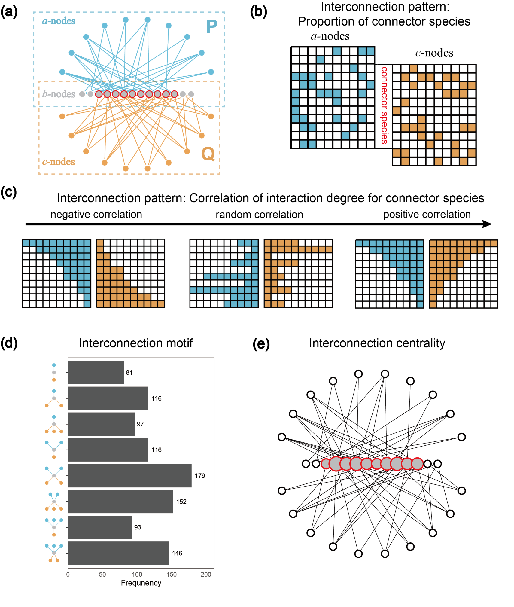
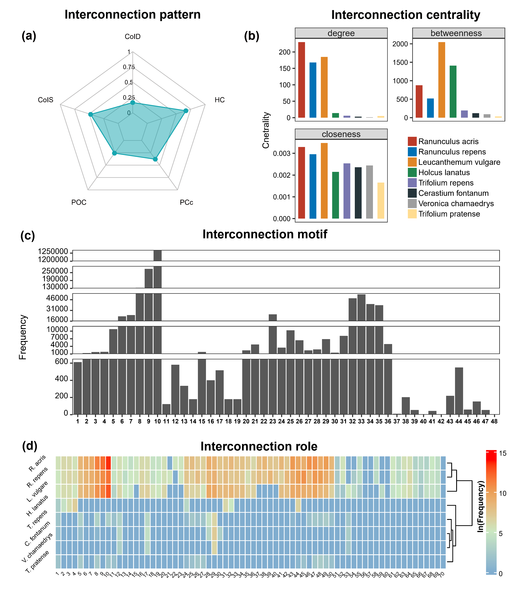
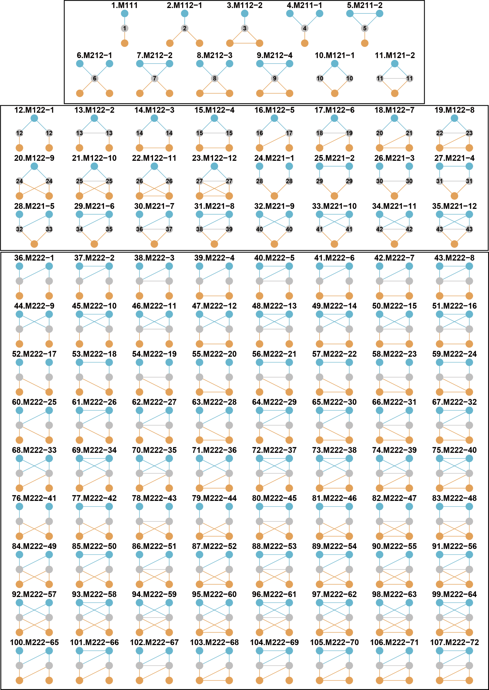
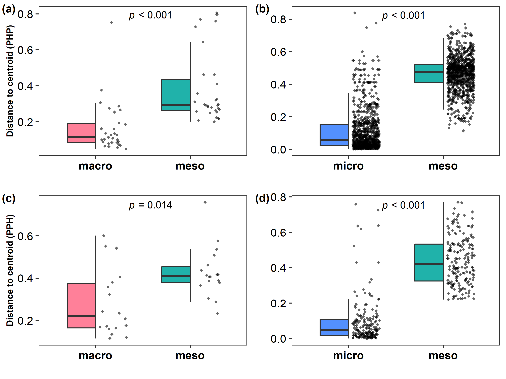
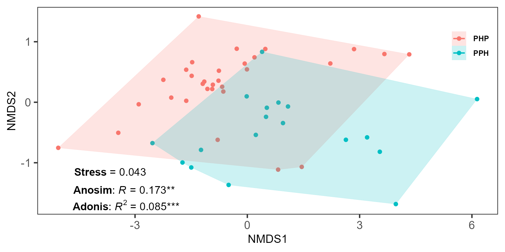

```{r, include = FALSE}
knitr::opts_chunk$set(
  collapse = TRUE,
  comment = "#>"
)
```


# ILSM: A package for analyzing the interconnection structure of tripartite interaction networks (updating)

<!-- badges: start -->

<!--[](https://cran.r-project.org/package=ILSM) -->

<!-- badges: end -->

ILSM is designed to analyze interconnection structures, including interconnection patterns, centrality, and motifs in tripartite interaction networks.

## Installation

You can install the development version of *ILSM* from GitHub:

```{r echo = T, eval = F}
devtools::install_github("WeichengSun/ILSM")
```

## A common tripartite interaction network in this package
For clarification, in the following context we refer to a tripartite network as a two-subnetwork interaction network (Fig. 1a). It is composed of three sets of nodes (a-nodes, b-nodes, and c-nodes) and two subnetworks: the P subnetwork, which contains links between a-nodes and b-nodes, and the Q subnetwork, which contains links between b-nodes and c-nodes. The b-nodes serve as the shared set of nodes. Connector nodes are defined as the common nodes of both subnetworks within the b-nodes (Fig. 1a). No intra-guild interactions are considered unless specified.

```{r echo=F,eval = T,out.width = "70%",fig.align = 'center' }

```
Fig.1. The visualization of an example tripartite interaction network (a, with three groups of species and two interaction subnetworks) and interconnection structures for connector species (b-c, two macro-scale interconnection patterns; d, meso-scale interconnection motif; e, micro-scale interconnection centrality). In panel a, the connector species have links from both subnetworks.

<br>We provide three examples to showcase the functionality of the *ILSM* package and the ecological applications of interconnection motif analysis. First, we present a worked example demonstrating how to calculate interconnection patterns, motifs, and centralities (Fig. 1b-c). Second, we compare the differences in interconnection patterns, centralities, and motifs to characterize variation between empirical plant–herbivore–parasitoid (PHP) and pollinator–plant–herbivore (PPH) networks. Finally, we compare the profiles of interconnection motifs to assess whether they can differentiate PHP and PPH networks.


## A worked example of analyzing interconnection structures
As a worked example, we use a published pollinator–plant–herbivore (PPH) binary tripartite network (Villa-Galaviz et al. 2021). This PPH network (**PPH_Coltparkmeadow**) is a subset of a large hybrid network that includes plants, flower visitors, leaf miners, and parasitoids from a long-term nutrient manipulation experiment (Colt Park Meadows) located at 300 m elevation in Ingleborough National Nature Reserve, Yorkshire Dales, northern England (54°12′N, 2°21′W). It contains pollinators, plants, and herbivores, corresponding to mutualistic interactions in the pollinator–plant subnetwork and antagonistic interactions in the plant–herbivore subnetwork. Plants are the shared set of species between the two subnetworks. We also generate random weights to illustrate the analysis of interconnection structures in weighted or quantitative tripartite networks.

### Interconnection pattern
Interconnection pattern refers to a macro-scale property describing how connector nodes (species) interconnect two subnetworks. Five interconnection patterns are supported: proportion of connector nodes (**poc**), correlation of interaction degree (**coid**), correlation of interaction similarity (**cois**), participation coefficient (**pc**), and proportion of connector nodes in shared node hubs (**hc**).

```{r echo=T, eval = F, out.width = "100%"}
library(ILSM);library(igraph)
#Load the 'igraph' data 
data(PPH_Coltparkmeadow)
#Or read two matrices and transform them to an 'igraph'. .
P_mat<-as.matrix(read.csv("../data/PP.csv",row.names = 1,check.names=FALSE))
Q_mat<-as.matrix(read.csv("../data/HP.csv",row.names = 1,check.names=FALSE))
PPH_Coltparkmeadow<-trigraph_from_mat(P_mat,Q_mat,weighted = F)

#Generating random weights to showcase weighted metrics
E(PPH_Coltparkmeadow)$weight<-runif(length(E(PPH_Coltparkmeadow)),0.1,1) 

#proportion of connector nodes
poc(PPH_Coltparkmeadow)
poc(P_mat,Q_mat)
#correlation of interaction degree 
coid(PPH_Coltparkmeadow)
coid(PPH_Coltparkmeadow,weighted=T)
#correlation of interaction similarity
cois(PPH_Coltparkmeadow)
cois(PPH_Coltparkmeadow,weighted=T)
#participation coefficient 
pc(PPH_Coltparkmeadow)
pc(PPH_Coltparkmeadow,weighted=T)
#proportion of connector nodes in shared node hubs
hc(PPH_Coltparkmeadow)
hc(PPH_Coltparkmeadow,weighted=T)
```
### Interconnection motif

Here, we define 48 forms of interconnection motifs (Fig. 2). An interconnection motif must comprise three sets of connected nodes: the connector nodes (belonging to the b-nodes), the nodes in one subnetwork (belonging to the a-nodes in the P subnetwork), and the nodes in the other subnetwork (belonging to the c-nodes in the Q subnetwork). We further restrict each motif to contain no more than six nodes and to have no intra-guild interactions.

The 48 interconnection motifs are provided as *igraph* objects through the **Multi_motif** function in this package.
```{r echo=T,eval = F}
library(ILSM)
motif_names<-c("M111","M112","M113","M114","M211","M212","M213","M311","M312","M411","M121","M122-1",
       "M122-2","M122-3","M123-1","M123-2","M123-3","M123-4","M123-5","M221-1","M221-2",
       "M221-3","M222-1","M222-2","M222-3","M222-4","M222-5","M222-6","M222-7","M222-8",
       "M222-9","M321-1","M321-2","M321-3","M321-4","M321-5","M131","M132-1","M132-2",
       "M132-3","M132-4","M132-5","M231-1","M231-2","M231-3","M231-4","M231-5","M141")
mr <- par(mfrow=c(6,8),mar=c(1,1,3,1))
IM_res<-Multi_motif("all")
 for(i in 1:48){
     plot(a[[i]],
          vertex.size=30, vertex.label=NA,
          vertex.color="#D0E7ED",main=motif_names[i])
}
par(mr)

```

The 48 interconnection motifs are named "MABC-i": M means "motif',"A" is the number of a-nodes, "B" is the number of b-nodes, "C" is the number of c-nodes and "i" is the serial number for the motifs with the same "ABC". The interconnection motifs are ordered by the number of connector nodes (from 1 to 4). The numbers from 1 to 70 in connector nodes represent the unique roles defined by motifs. 

```{r echo=F,eval = T,out.width = "80%",fig.align = 'center' }
knitr::include_graphics("../man/figure/motif_ILSM.png")
```
Fig. 2. The 48 forms of interconnection motifs with 3-6 nodes and no intra-guild interactions. Blue and grey nodes from one subnetwork, and grey and orange nodes from the other subnetwork. Grey nodes are connector nodes. 

<br>For a tripartite network, the **icmotif_count** function returns the counts of each motif, while **icmotif_role** provides the counts of motif roles.
```{r echo = T,eval = F}
icmotif_count(PPH_Coltparkmeadow)
icmotif_role(PPH_Coltparkmeadow)
icmotif_count(PPH_Coltparkmeadow, weighted=T)
icmotif_role(PPH_Coltparkmeadow, weighted=T)
```

### Interconnection centrality
Interconnection centrality measures the importance of connector nodes in linking two subnetworks within a tripartite network. This differs from standard centrality measures (e.g., those in *igraph*), which treat connector nodes the same as other nodes. The **node_icc** provides three interconnection centrality metrics. For binary networks, interconnection degree centrality for each connector species is defined as the product of its degree values from the two subnetworks. Interconnection betweenness centrality is calculated as the number of shortest paths between a-nodes and c-nodes that pass through the connector species. Interconnection closeness centrality is defined as the inverse of the sum of distances from the connector species to both a-nodes and c-nodes. For weighted networks, interaction strengths are incorporated into the calculations of weighted degree, shortest paths, and distances.
```{r echo = T, eval = F}
node_icc(PPH_Coltparkmeadow)
node_icc(PPH_Coltparkmeadow,weighted=T)
```

Plotting results of interconnection patterns, centralities and motifs.
```{r echo = T,eval = F}
library(ILSM)
library(fmsb)
library(reshape2)
library(ggbreak)
library(gg.gap)
library(ComplexHeatmap)

data(PPH_Coltparkmeadow)
PPH_net_rader<-data.frame(row.names = c("Max","Min","PPH"),
                      CoID=c(1,0,coid(PPH_Coltparkmeadow)),
                      CoIS=c(1,0,cois(PPH_Coltparkmeadow)),
                      POC=c(1,0,poc(PPH_Coltparkmeadow)),
                      PCc=c(1,0,pc(PPH_Coltparkmeadow)),
                      HC=c(1,0,hc(PPH_Coltparkmeadow)))
radarchart(PPH_net_rader,
           # Customize the polygon
           pcol = c("#00AFBB"), pfcol = scales::alpha(c("#00AFBB"),0.5), plwd = 1.2, plty = 1,
           # Customize the grid
           cglcol = "grey", cglty = 1, cglwd =0.8,
           # Customize the axis
           axistype=1, caxislabels = c(0, 0.25, 0.5, 0.75, 1.00),
           axislabcol = "black",
           calcex=0.6,
           # Variable labels
           vlcex = 0.7, vlabels = colnames(PPH_net_rader),title = "Interconnection pattern")


PPH_node_centrality<-node_icc(PPH_Coltparkmeadow)
PPH_node_centrality <- PPH_node_centrality[,c(2:4)]
rownames(PPH_node_centrality)<- c("Cerastium fontanum", "Holcus lanatus","Leucanthemum vulgare","Ranunculus acris","Ranunculus repens","Trifolium pratense","Trifolium repens","Veronica chamaedrys")

PPH_node_centrality_bar <- melt(as.matrix(PPH_node_centrality))
PPH_node_centrality_bar[,1] <-factor(PPH_node_centrality_bar[,1],levels = c("Ranunculus acris","Ranunculus repens","Leucanthemum vulgare", "Holcus lanatus","Trifolium repens","Cerastium fontanum","Veronica chamaedrys","Trifolium pratense"))      

colnames(PPH_node_centrality_bar)[1:2] <- c("species","centrality")

ggplot(PPH_node_centrality_bar)+
  geom_bar(aes( species,value,fill= species),stat="identity",  #position = 'stack',
           width = 0.6)+
  facet_wrap(vars(centrality), nrow = 2,scales = "free")+
  labs(x="",y="Cnetrality",title = "Interconnection centrality")+
  scale_fill_manual(values=c("#BC3C29","#0072B5","#E18727","#20854E","#7876B1","#26343B","#9E9E9E","#FFDC91"))+
  theme_test()+
  theme(
    strip.text = element_text(size = 10 ,margin = margin(t =1.4, b = 1.4, l = 1.2, r = 1.2)),
    legend.position = c( .80 , .25 ),
    plot.title = element_text(hjust = 0.5,face = "bold" ),
    legend.byrow= T,
    legend.title =element_blank(),
    legend.text = element_text(size = 9,margin = margin(t =1.6, b = 1.8, l = 1.2, r = 1.2)), 
    legend.key.size = unit(.8, "lines"),
    legend.box.spacing = unit(8, "cm"),
    # legend.position = "top",
    legend.margin = margin(-0.1, 0, -0.2, -0.7, "cm"),
    plot.margin = margin(0.1, 0.1, -0.1, 0.1, "cm"),
    axis.title = element_text(size = 10),
    axis.text = element_text(size= 7.5,colour = "black"),
    axis.text.x = element_blank(),
    axis.ticks.x= element_blank())


PPH_motif_bar<-data.frame(motif_id=1:48,frequency = icmotif_count(PPH_Coltparkmeadow))
PPH_motif_bar$motif_id<-factor(PPH_motif_bar$motif_id)

ggplot(PPH_motif_bar,aes(motif_id,frequency))+
   geom_bar(stat="identity",show.legend=F)+
   scale_y_break(breaks=c(300000,1200000),ticklabels=seq(1200000,1300000,50000),scales=0.2,expand =F)+
   scale_y_break(breaks=c(55000,130000),ticklabels=seq(130000,300000,60000),scales=0.4,expand =F)+
   scale_y_break(breaks=c(12000,16000),ticklabels=seq(16000,55000,15000),scales=0.5,expand =F)+
   scale_y_break(breaks=c(650,1000),ticklabels=seq(1000,12000,3000),scales=0.5,expand =F)+
      labs(x="",y="Frequency",title = "Interconnection motif")+
   theme_test()+
   theme(legend.position="none") + theme(axis.title = element_text(),
                                         axis.text = element_text( colour = "black"),
                                         axis.text.x = element_text(size =7 ,colour = "black"),
                                         axis.text.y = element_text(vjust = 0.15,colour = "black"),
                                         plot.title = element_text(hjust = 0.5,face = "bold" ))


PPH_role <- icmotif_role(PPH_Coltparkmeadow)
PPH_role_heatmap<-PPH_role[rowSums(PPH_role)!=0,]

rownames(PPH_role_heatmap)<-c( "C. fontanum","H. lanatus","L. vulgare","R. acris","R. repens","T. pratense","T. repens","V. chamaedrys" )
colnames(PPH_role_heatmap)<-gsub("role","",colnames(PPH_role_heatmap))


Heatmap((log(PPH_role_heatmap + 1)),
        cluster_rows = T,
        cluster_columns = F,
        row_dend_side = c("right"),
        col = circlize::colorRamp2(c(0, 5, 10, 14), c("#80aecf", "#cbe8c3", "#eca058", "red")),
        rect_gp = gpar(col = "white", lwd = 1),
        show_heatmap_legend = T,
        heatmap_legend_param = list(
          legend_direction = "vertical",
          title = "ln(Frequency)",
          title_gp = gpar(fontsize = 7, fontface =
                            "bold"),
          title_position = "leftcenter-rot",
          legend_height = unit(5, "cm"),
          labels_gp = gpar(fontsize = 6)
        ),
        column_title = "Interconnection role",
        column_title_side = "top",
        column_title_gp = gpar(fontface = "bold"),
        row_names_side = "left",
        row_names_rot = 45,
        column_names_rot = 45,
        column_names_gp = gpar(fontsize = 6),
        row_names_gp = gpar(fontsize = 7),
        column_names_centered = F,
        row_names_centered = T
)
```

```{r echo=F,eval = T,out.width = "70%",fig.align = 'center' }

```

## Extensional analysis
### Null models
Null models are commonly used to test the non-randomness of topology in ecological networks. The **tri_null** provides two types of null models. The first type shuffles shared nodes following Sauve et al. (2016) without altering the subnetwork structures. The second type shuffles links in one or both subnetworks using algorithms from the R package *vegan* (version 2.6-4), applied independently to one or both subnetworks.

```{r echo = T, eval = F}
#Testing the significance of correlation of interaction degree and similarity
library(ggplot2)
set.seed(12)
coid_obs<-coid(PPH_Coltparkmeadow)
cois_obs<-cois(PPH_Coltparkmeadow)
null_net<-tri_null(PPH_Coltparkmeadow,100, null_type = "sauve")# try "sub_both", "sub_
coid_null<-sapply(null_net,coid)
cois_null<-sapply(null_net,cois)
# calculate the Z value and P value.
null_zp<-function(original_value,nullvalues){
   z=(original_value-mean(nullvalues,na.rm=T))/sd(nullvalues,na.rm=T)
   pless <- sum(original_value >= nullvalues, na.rm = TRUE)
   pmore <- sum(original_value <= nullvalues, na.rm = TRUE)
   p<-2 * pmin(pless, pmore)
   p=pmin(1, (p + 1)/(length(nullvalues) + 1))
   c(z=z,p=p)
}
null_zp(coid_obs,coid_null)
null_zp(cois_obs,cois_null)
```

### For tripartite networks with intra-guild interactions
#### Interconnection motifs with intra-guild interactions
Although most empirical tripartite interaction networks currently lack intra-guild interactions, these interactions are increasingly studied (Garcia-Callejas et al. 2023) and play a crucial role in community dynamics. Therefore, we also defined interconnection motif forms that include intra-guild interactions to support potential meso-scale analyses in tripartite networks. Because incorporating intra-guild links greatly increases the number of possible motif forms, we restricted each guild to contain only two nodes, resulting in 107 interconnection motifs.

```{r echo=F,eval = T,out.width = "80%",fig.align = 'center' }

```
Fig. 3. The 107 forms of interconnection motifs with intra-guild interactions. Each guild contains only two nodes at most. Blue and grey nodes from one subnetwork, and grey and orange nodes from the other subnetwork. Grey nodes are connector nodes. 

For a tripartite network with intra-guild interactions, **ig_icmotif_count** returns the counts of each motif, while **ig_icmotif_role** returns the counts of motif roles. Currently, ig_icmotif_role supports role counts only for the first 11 motifs.
```{r echo = T,eval = F}
ig_icmotif_count(PPH_Coltparkmeadow)
ig_icmotif_role(PPH_Coltparkmeadow)
ig_icmotif_count(PPH_Coltparkmeadow, weighted=T)
ig_icmotif_role(PPH_Coltparkmeadow, weighted=T)
```

#### Degree of diagonal dominance
The **ig_ddom** calculates the degree of diagonal dominance for a tripartite network with intra-guild interactions (Garcia-Callejas et al. 2023).
```{r echo = T,eval = F}
## A toy tripartite network with intra-guild negative interactions, inter-guild mutualistic interactions and inter-guild antagonistic interactions.
set.seed(12)
##4 a-nodes,5 b-nodes, and 3 c-nodes

##intra-guild interaction matrices
mat_aa<-matrix(runif(16,-0.8,-0.2),4,4)
mat_bb<-matrix(runif(25,-0.8,-0.2),5,5)
mat_cc<-matrix(runif(9,-0.8,-0.2),3,3)

##inter-guild interaction matrices between a- and b-nodes.
mat_ab<-mat_ba<-matrix(sample(c(rep(0,8),runif(12,0,0.5))),4,5,byrow=T)# interaction probability = 12/20
mat_ba[mat_ba>0]<-runif(12,0,0.5);mat_ba<-t(mat_ba)

##inter-guild interaction matrices between b- and c-nodes.
mat_cb<-mat_bc<-matrix(sample(c(rep(0,8),runif(7,0,0.5))),3,5,byrow=T)# interaction probability = 7/15
mat_bc[mat_bc>0]<-runif(7,0,0.5);mat_bc<--t(mat_bc)
toy_mat<-rbind(cbind(mat_aa,mat_ab,matrix(0,4,3)),cbind(mat_ba,mat_bb,mat_bc),cbind(matrix(0,3,4),mat_cb,mat_cc))

##set the node names
rownames(toy_mat)<-c(paste0("a",1:4),paste0("b",1:5),paste0("c",1:3));colnames(toy_mat)<-c(paste0("a",1:4),paste0("b",1:5),paste0("c",1:3))
diag(toy_mat)<--1 #assume -1 for diagonal elements

ig_ddom(toy_mat)
```
#### Species-level intra-guild and inter-guild interaction overlap
The **ig_overlap_guild** calculates species-level intra-guild and inter_guild interaction overlap for a tripartite network with intra-guild interactions (Garcia-Callejas et al. 2023).

```{r echo = T,eval = F}
myguilds=c(rep("a",4),rep("b",5),rep("c",3))
ig_overlap_guild(toy_mat,guilds=myguilds)
```

## Comparison among interconnection patterns, centralities and motifs
Plant-herbivore-parasitoid (PHP) and pollinator-plant-herbivore (PPH) networks are two kinds of commonly studied tripartite networks. They also have different connector nodes, herbivores in PHP networks and plants in PPH networks. To show whether interconnection motifs can provide extra information beyond macro-scale interconnection patterns and micro-scale centralities, we compared their differences in characterizing variation of tripartite networks using 31 PHP networks and 18 PPH networks from empirical studies at the network and species levels. The network data were provided in published articles (Domínguez-García and Kéfi 2024, Timóteo et al. 2023). This approach has been similarly applied by Benno I. Simmons et al. (2019).
  At the network level, we constructed a vector of five interconnection pattern indices and a vector of 48 interconnection motifs for each network. Then we calculated the pairwise distances between all networks using their structural vectors of interconnection patterns or motifs. The distances were normalized by dividing the maximum distance between any two networks, giving values between 0 (for identical networks) and 1 (for completely different networks). Based on the distance matrices, we assigned each network a macro-scale and meso-scale variation value using its distance from the centroid representing the ‘typical’ structure through the betadisper function from the R package “vegan” (version: 2.6-4) (Dixon 2003). The paired Wilcoxon Signed-Rank Test show that meso-scale interconnection motifs capture more dissimilarity than interconnection patterns in both PPH and PHP networks (PHP, V = 20, p < 0.001; PPH, V = 32, p = 0.018, Fig. 4a and c).  
  At the species level, we characterized the connector species’ micro-scale (centrality) roles using three interconnection centrality indices and its meso-scale (interconnection motif) roles using the vectors describing the frequency with which species occurs in all unique positions across 48 interconnection motifs for each connector species in each network. We then calculated the pairwise distances between all connector species using their structural vectors of centrality or motif roles in each network, and normalized distances as above. Finally, we assigned each species a micro-scale and meso-scale variation value using its distance from the centroid. The paired Wilcoxon Signed-Rank Test shows that meso-scale roles capture more dissimilarity than micro-scale centralities for connector species (PHP, V = 2708, p < 0.001; PPH, V= 6, p < 0.001, Fig. 4b and d).  

**PPH network**
<br>Macro-scale interconnection patterns vs interconnection motifs
```{r echo = T, eval = F}
library(ILSM)
library(rdist)
library(vegan)
library(ggplot2)
library(gghalves)
library(ggpubr)
load("./data/PPH_Network.rda")
#interconnection pattern
PPH_IP <-
   t(as.data.frame(lapply(PPH_Network, function(x) {
      c(poc(x),coid(x), cois(x), pc(x),  hc(x))
   })))
rownames(PPH_IP) <- paste0("net", seq = 1:18)
PPH_IP[is.na(PPH_IP)] <- 0
PPH_IP_dist <- rdist(PPH_IP, metric = "correlation")
PPH_IP_dist <- PPH_IP_dist / max(PPH_IP_dist)
PPH_IP_dist_beta <-betadisper(PPH_IP_dist, group = rep("net", 18), type = "centroid")$distances
#interconnection motif
PPH_motif <-
   t(as.data.frame(lapply(PPH_Network, function(x) {
      icmotif_count(x)
   })))
rownames(PPH_motif) <- paste0("net", seq = 1:18)
PPH_motif_dist <- rdist(PPH_motif, metric = "correlation")
PPH_motif_dist <- PPH_motif_dist / max(PPH_motif_dist)
PPH_motif_dist_beta <-betadisper(PPH_motif_dist, group = rep("net", 18), type = "centroid")$distances

PPH_macro.vs.meso <-
   data.frame(
      type = c(rep(c("macro", "meso"), each = 18)),
      dist_cen = c(PPH_IP_dist_beta, PPH_motif_dist_beta)
   )
PPH_macro.vs.meso$type <- factor(PPH_macro.vs.meso$type)
#Wilcoxon test 
pph_wilcox <-wilcox.test(PPH_macro.vs.meso[1:18, 2], PPH_macro.vs.meso[19:36, 2], paired = T)
pph_wilcox$statistic
pph_wilcox$p.value
#plot
ggplot(PPH_macro.vs.meso,aes(type,dist_cen))+
   geom_half_boxplot(aes(fill=type),
                outlier.shape = NA,nudge =0, width = .6,errorbar.draw = F)+
   theme_test()+
   geom_half_point(side = "r",shape=18,
               alpha = 0.6,size=1)+
   scale_fill_manual(values=c("#ff8099","#20b2aa"))+
   # annotate("text", label = "paste(bold(italic(p)), \" = 0.014 \")" ,
   #          x = 1.5, y = 0.744, size = 3.2, colour = "black",parse=T)+
   labs(x="",y="Distance to centroid (PPH)")+
   stat_compare_means(method="wilcox.test",paired = T,size=5,vjust = 0.5,hjust=-0.3)+
   theme(legend.position="none") + theme(axis.title = element_text(size = 8, face = "bold"),
                                         axis.text = element_text(size = 10,color = "black"),
                                         axis.text.x = element_text(size = 10, face = "bold"),
                                         axis.text.y = element_text(size = 10))
```
Micro-scale interconnection centrality vs interconnection motif role
```{r echo = TRUE, eval = FALSE}

#interconnection motif role
PPH_MOTIF_ROLE_list<-lapply(PPH_Network, function(x){icmotif_role(x)})
#interconnection centrality
PPH_IC_list<-lapply(PPH_Network, function(x){node_icc(x)})

re_adjust<-function(role,cen){
   spe<-rownames(role)[which(rowSums(role)!=0)]
   cen<-cen[,-1]
   cen<-apply(cen, 1, function(x){as.numeric(x)})%>%t()
   return(list(role[spe,],cen[spe,],length(spe)))
}
group <- NULL
PPH_MOTIF_ROLE <- NULL
PPH_IC <- NULL
for(i in 1:18){
   l <- nrow(PPH_IC_list[[i]])
   group <- c(group,rep(paste0("net",i),l))
   PPH_read<-re_adjust(PPH_MOTIF_ROLE_list[[i]],PPH_IC_list[[i]])
   PPH_MOTIF_ROLE<-rbind(PPH_MOTIF_ROLE,PPH_read[[1]])
   PPH_IC<-rbind(PPH_IC,PPH_read[[2]])
}
groups <- factor(group,levels = paste0("net",1:18))

PPH_IC_dist <- rdist(PPH_IC, metric = "correlation")
PPH_IC_dist <- PPH_IC_dist / max(PPH_IC_dist)
PPH_IC_dist_beta <-betadisper(PPH_IC_dist, groups, type = "centroid")$distances

PPH_MOTIF_ROLE_dist <- rdist(PPH_MOTIF_ROLE, metric = "correlation")
PPH_MOTIF_ROLE_dist <- PPH_MOTIF_ROLE_dist / max(PPH_MOTIF_ROLE_dist)
PPH_MOTIF_ROLE_dist_beta <-betadisper(PPH_MOTIF_ROLE_dist, groups, type = "centroid")$distances

PPH_micro.vs.meso <-
   data.frame(type = c(rep(c("micro", "meso"), each = length(group))),
              dist_cen = c(PPH_IC_dist_beta, PPH_MOTIF_ROLE_dist_beta))
PPH_micro.vs.meso$type <- factor(PPH_micro.vs.meso$type,levels = c("micro","meso"))

#Wilcoxon test 
pph_wilcox <- wilcox.test(PPH_micro.vs.meso[1:184, 2], PPH_micro.vs.meso[185:368, 2], paired = T)
pph_wilcox$statistic
pph_wilcox$p.value
#plotting
ggplot(PPH_micro.vs.meso,aes(type,dist_cen))+
   geom_half_boxplot(aes(fill=factor(type)),outlier.shape = NA, width = .6,errorbar.draw = F)+
   theme_test()+
   scale_fill_manual(values=c("#5390fe","#20b2aa"))+
   geom_half_point(side = "r",
                   shape=18,
                   alpha = 0.6,size=1)+
   annotate("text", label = "paste(bold(italic(p)), \" < 0.001 \")",
            x = 1.5, y = 0.74, size = 3.2, colour = "black",parse=T)+
   labs(x="",y="Distance to centroid (PPH)")+
   theme(legend.position="none") + theme(axis.title = element_text(size = 8, face = "bold"),
                                         axis.text = element_text(size = 10,color = "black"),
                                         axis.text.x = element_text(size = 10, face = "bold"),
                                         axis.text.y = element_text(size = 10))
```

**PHP network data**
<br>Macro-scale interconnection patterns vs interconnection motifs
```{r echo = TRUE, eval = FALSE}
load("./data/PHP_Network.rda")
#interconnection pattern
PHP_IP <-
   t(as.data.frame(lapply(PHP_Network, function(x) {
      c(coid(x), cois(x), pc(x), pc(x), hc(x))
   })))
rownames(PHP_IP) <- paste0("net", seq = 1:31)
PHP_IP[is.na(PHP_IP)] <- 0
PHP_IP_dist <- rdist(PHP_IP, metric = "correlation")
PHP_IP_dist <- PHP_IP_dist / max(PHP_IP_dist)
PHP_IP_dist_beta <-betadisper(PHP_IP_dist, group = rep("net", 31), type = "centroid")$distances

adjust_net(PHP_Network[[1]])
#interconnection motif
PHP_MOTIF <-
   t(as.data.frame(lapply(PHP_Network, function(x) {
      icmotif_count(x)
   })))
rownames(PHP_MOTIF) <- paste0("net", seq = 1:31)
PHP_MOTIF_dist <- rdist(PHP_MOTIF, metric = "correlation")
PHP_MOTIF_dist <- PHP_MOTIF_dist / max(PHP_MOTIF_dist)
PHP_MOTIF_dist_beta <-betadisper(PHP_MOTIF_dist, group = rep("net", 31), type = "centroid")$distances

PHP_macro.vs.meso <-
   data.frame(
      type = c(rep(c("macro", "meso"), each = 31)),
      dist_cen = c(PHP_IP_dist_beta, PHP_MOTIF_dist_beta)
   )
PHP_macro.vs.meso$type <- factor(PHP_macro.vs.meso$type)

#Wilcoxon test 
php_wilcox <-
   wilcox.test(PHP_macro.vs.meso[1:31, 2], PHP_macro.vs.meso[32:62, 2], paired = T)
php_wilcox$statistic
php_wilcox$p.value
#plotting
ggplot(PHP_macro.vs.meso,aes(type,dist_cen))+
   geom_half_boxplot(aes(fill=type),
                outlier.shape = NA,nudge =0, width = .6,errorbar.draw = F)+
   theme_test()+
   geom_half_point(side = "r",shape=18,
               alpha = 0.6,size=1)+
   scale_fill_manual(values=c("#ff8099","#20b2aa"))+
   labs(x="",y="Distance to centroid (PHP)")+
   stat_compare_means(method="wilcox.test",paired = T,size=5,vjust = 0.5,hjust=-0.3)+
   theme(legend.position="none") + theme(axis.title = element_text(size = 8, face = "bold"),
                                         axis.text = element_text(size = 10,color = "black"),
                                         axis.text.x = element_text(size = 10, face = "bold"),
                                         axis.text.y = element_text(size = 10))
```
Micro-scale interconnection centrality vs interconnection motif role
```{r echo = TRUE, eval = FALSE}
#interconnection motif role
PHP_MOTIF_ROLE_list<-lapply(PHP_Network, function(x){icmotif_role(x)})
#interconnection centrality
PHP_IC_list<-lapply(PHP_Network, function(x){node_icc(x)})

re_adjust<-function(role,cen){
   spe<-rownames(role)[which(rowSums(role)!=0)]
   cen<-cen[,-1]
   cen<-apply(cen, 1, function(x){as.numeric(x)})%>%t()
   return(list(role[spe,],cen[spe,],length(spe)))
}
group <- NULL
PHP_MOTIF_ROLE <- NULL
PHP_IC <- NULL
for(i in 1:31){
   l <- nrow(PHP_IC_list[[i]])
   group <- c(group,rep(paste0("net",i),l))
   PHP_read<-re_adjust(PHP_MOTIF_ROLE_list[[i]],PHP_IC_list[[i]])
   PHP_MOTIF_ROLE<-rbind(PHP_MOTIF_ROLE,PHP_read[[1]])
   PHP_IC<-rbind(PHP_IC,PHP_read[[2]])
}
groups <- factor(group,levels = paste0("net",1:31))


PHP_IC_dist <- rdist(PHP_IC, metric = "correlation")
PHP_IC_dist <- PHP_IC_dist / max(PHP_IC_dist)
PHP_IC_dist_beta <-betadisper(PHP_IC_dist, groups, type = "centroid")$distances

PHP_MOTIF_ROLE_dist <- rdist(PHP_MOTIF_ROLE, metric = "correlation")
PHP_MOTIF_ROLE_dist <- PHP_MOTIF_ROLE_dist / max(PHP_MOTIF_ROLE_dist)
PHP_MOTIF_ROLE_dist_beta <-betadisper(PHP_MOTIF_ROLE_dist, groups, type = "centroid")$distances

PHP_micro.vs.meso <-
   data.frame(type = c(rep(c("micro", "meso"), each = length(group))),
              dist_cen = c(PHP_IC_dist_beta, PHP_MOTIF_ROLE_dist_beta))
PHP_micro.vs.meso$type <- factor(PHP_micro.vs.meso$type,levels = c("micro","meso"))

#Wilcoxon test 
PHP_wilcox <- wilcox.test(PHP_micro.vs.meso[1:927, 2], PHP_micro.vs.meso[928:1854, 2], paired = T)
PHP_wilcox$statistic
PHP_wilcox$p.value
#plotting 
ggplot(PHP_micro.vs.meso,aes(type,dist_cen))+
   geom_half_boxplot(aes(fill=factor(type)),outlier.shape = NA, width = .6,errorbar.draw = F)+
   theme_test()+
   scale_fill_manual(values=c("#5390fe","#20b2aa"))+
   geom_half_point(side = "r",
                   shape=18,
                   alpha = 0.6,size=1)+
   annotate("text", label = "paste(bold(italic(p)), \" < 0.001 \")",
            x = 1.5, y = 0.74, size = 3.2, colour = "black",parse=T)+
   labs(x="",y="Distance to centroid (PHP)")+
   theme(legend.position="none") + theme(axis.title = element_text(size = 8, face = "bold"),
                                         axis.text = element_text(size = 10,color = "black"),
                                         axis.text.x = element_text(size = 10, face = "bold"),
                                         axis.text.y = element_text(size = 10))
```

```{r echo=F,eval = T,out.width = "80%",fig.align = 'center' }

```

## Comparison of interconnection motifs between PHP and PPH networks
As an example of application, we also compared the profiles of interconnection motifs between PHP and PPH networks using nonmetric multidimensional scaling (NMDS). NMDS is a robust technique for indirect gradient analysis based on a distance or dissimilarity matrix for ecological data. We performed NMDS analysis with the metaMDS function using Bray-Curtis dissimilarities and tested statistical differences with 'adonis2' and 'anosim' in the R package *vegan* (version: 2.6-4). The result shows their profiles of interconnection motifs are significantly different between PHP and PPH networks (Fig. 5), suggesting that interconnection motifs can characterize how different bipartite networks are interconnected in different types of tripartite interaction networks.
```{r echo=T,eval = F }
library(ILSM)
library(dplyr)
library(vegan)
library(ggalt)

data(PPH_Network)
data(PHP_Network)
The_structure_motif <-
   rbind(
      lapply(PHP_Network, function(z) {
         ILSM::icmotif_count(z)
      }) %>% data.frame() %>% t(),
      lapply(PPH_Network, function(z) {
         ILSM::icmotif_count(z)
      }) %>% data.frame() %>% t()
   )

rownames(The_structure_motif)<-c(paste0("PHP",seq=1:31),paste0("PPH",seq=1:18))

The_structure_motif_nmds<-The_structure_motif%>%vegdist(method = "bray")%>%metaMDS(k=2)

The_structure_motif_sample<-The_structure_motif_nmds$points%>%data.frame()
The_structure_motif_sample$name<-c(rep("PHP",31),rep("PPH",18))
colnames(The_structure_motif_sample)[1:2]<-c("NMDS1","NMDS2")

The_structure_motif_nmds$stress

ggplot(The_structure_motif_sample,aes(NMDS1,NMDS2,color=name))+
   geom_point(size=1)+
   theme_test()+
   theme(#panel.border=element_rect(linewidth = 1),
         axis.title = element_text(size = 9),axis.text = element_text(size = 9),legend.key.size = unit(4,"mm"),
         legend.text = element_text(size=6,face = "bold"),legend.position.inside = c( .94 , .86 ))+
   geom_encircle(aes(NMDS1,NMDS2,group = name,fill=name),size=0.2,expand=0,spread=0,alpha =0.2,s_shape=1)+
   annotate("text", label = "paste(bold(Adonis),\": \" ,italic(R)^2, \" = 0.085*** \" )",
            x = -3.2, y = -1.7, size = 3, colour = "black",parse=T)+
   annotate("text", label = "paste(bold(Anosim) , \": \",italic(R), \" = 0.173** \"  )",
            x = -3.25, y = -1.45, size = 3, colour = "black",parse=T)+
   annotate("text", label = "paste(bold(Stress) , \" = 0.043\")",
            x = -3.66, y = -1.15, size = 3, colour = "black",parse=T)+
   scale_fill_discrete(name="")+scale_color_discrete(name="")

```

```{r echo=F,eval = T,out.width = "80%",fig.align = 'center' }

```


## License

The code is released under the MIT license (see LICENSE file).

## References

Villa-Galaviz, E., et al. 2021. Differential effects of fertilisers on pollination and parasitoid interaction networks. Journal of Animal Ecology, 90, 404-414.

Simmons, B. I., Sweering, M. J., Schillinger, M., Dicks, L. V., Sutherland, W. J., & Di Clemente, R. 2019. bmotif: A package for motif analyses of bipartite networks. Methods in Ecology and Evolution, 10(5), 695-701.

Mora, B.B., Cirtwill, A.R. and Stouffer, D.B., 2018. pymfinder: a tool for the motif analysis of binary and quantitative complex networks. bioRxiv, 364703.

Domínguez-García, V., & Kéfi, S. 2024. The structure and robustness of ecological networks with two interaction types. PLOS Computational Biology, 20(1), e1011770.

Sauve, A. M., Thébault, E., Pocock, M. J., & Fontaine, C. 2016. How plants connect pollination and herbivory networks and their contribution to community stability. Ecology, 97(4), 908-917.

Pilosof, S., Porter, M. A., Pascual, M., & Kéfi, S. 2017. The multilayer nature of ecological networks. Nature Ecology & Evolution, 1(4), 0101.

Domenico, M. D. 2022. Multilayer Networks: Analysis and Visualization. Introduction to muxViz with R. . Springer, Cham.

Garcia-Callejas, D., et al. 2023. Non-random interactions within and across guilds shape the potential to coexist in multi-trophic ecological communities. Ecology Letters, 26, 831-842.

## Citation

Manuscript is being prepared for submission and citations are currently available at CRAN [10.32614/CRAN.package.ILSM](https://cran.r-project.org/web/packages/ILSM/index.html)
